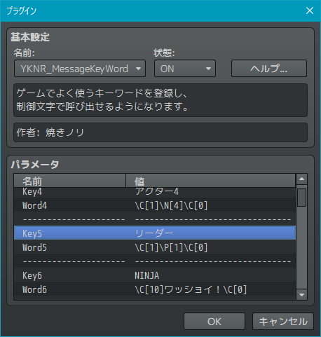
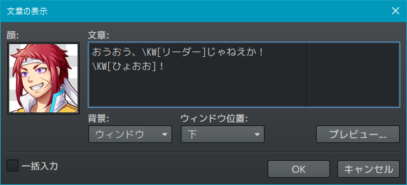
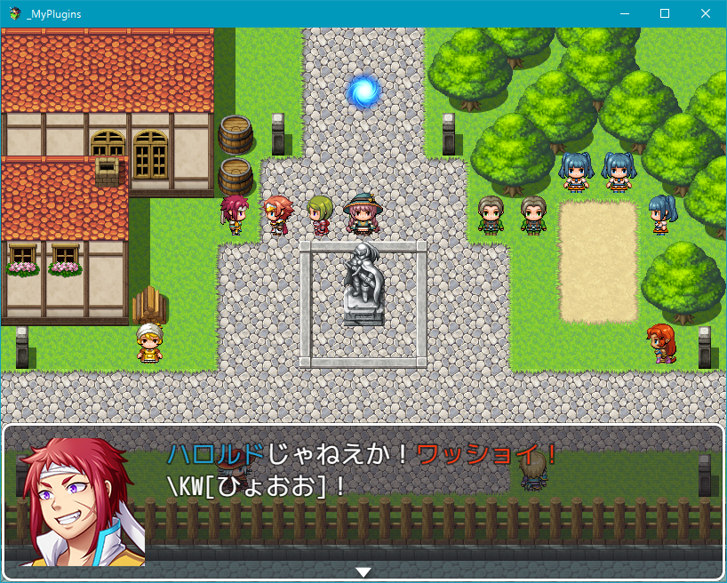
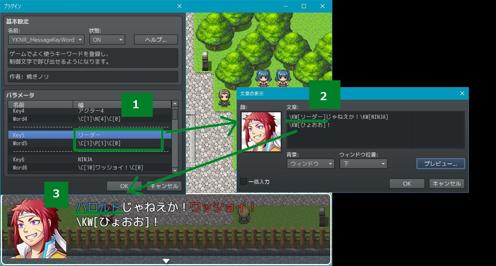

# YKNR_MessageKeyWord.js [Ver.2.0.1]
ゲームでよく使うキーワードを登録し、制御文字（\KW[***]）で呼び出せるようになります。  
既存の制御文字はもちろん、他のプラグインによって追加された制御文字もサポートしています。  
 
「キャラ名には必ず特定の色を付けるというルールを決めていたが、途中で別の色に変更したい...」  
そんなときにこのプラグインを活用していれば、一括で変更できたりします。

---

<!-- ここからURL一覧 -->
[LICENSE]: ./LICENSE
[【Download】]: ./YKNR_MessageKeyWord.js
<!-- ここまでURL一覧 -->

## ダウンロード
*右クリック → 名前を付けて保存* でプラグインをダウンロードできます。  
[【Download】][]

---
## 使用方法
デフォルトで登録されているキーワードの一覧。不要であれば削除してもよい。  
例えばこの設定は、"\KW[リーダー]" とメッセージに入力すると、  
ゲーム中では "\C[1]\P[1]\C[0]" に置換される。  
  

実際に "\KW[リーダー]" と未登録の "\KW[ひょおお]" を入力してみる。  
  

プレイして確かめてみると、 "\KW[リーダー]" は "\C[1]\P[1]\C[0]" に置換され、  
色変え→パーティ1人目の名前→色戻し が正しく行われている。  
なお、未登録の "\KW[ひょおお]" はそのまま出力されている。
  

---
## その他のスクリーンショット

---
## License
ライセンスは MIT License です。  
[LICENSE][]

---
## Author
焼きノリ
[[Twitter](https://twitter.com/Noritake0424)]
[[Blog](http://mata-tuku.ldblog.jp/)]
