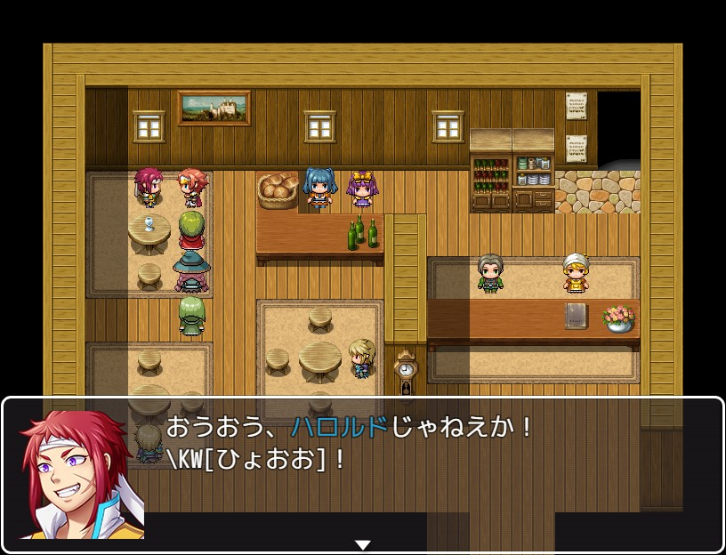

# YKNR_MessageKeyWord.js [Ver.2.0.1]
ゲームでよく使うキーワードを登録し、  
制御文字（\KW[***]）で呼び出せるようになります。

---

<!-- ここからURL一覧 -->
[LICENSE]: ./LICENSE
[【Download】]: ./YKNR_MessageKeyWord.js
<!-- ここまでURL一覧 -->

## ダウンロード
*右クリック → 名前を付けて保存* でプラグインをダウンロードできます。  
[【Download】][]

---
## 使用方法
説明文など

---
## スクリーンショット

---
## License
ライセンスは MIT License です。  
[LICENSE][]

---
## Author
焼きノリ
[[Twitter](https://twitter.com/Noritake0424)]
[[Blog](http://mata-tuku.ldblog.jp/)]
