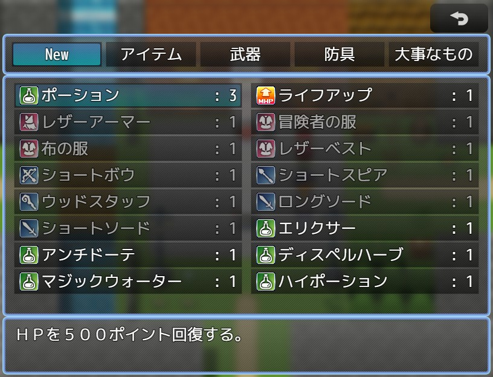
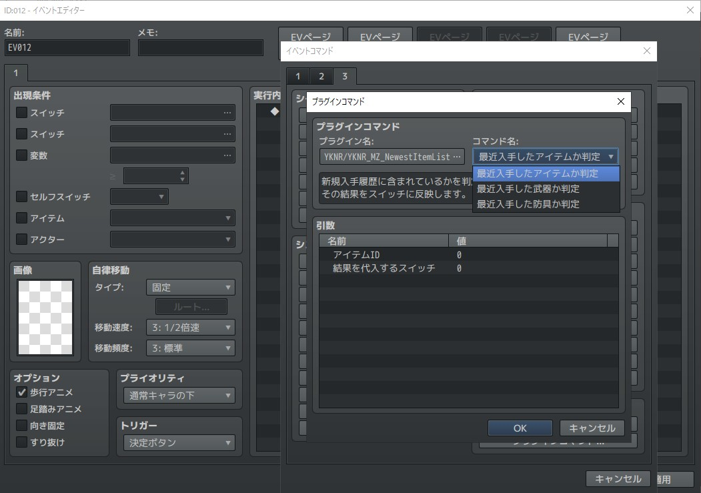

# YKNR_NewestItemList.js [Ver.1.0.0]
アイテム/武器/防具の入手を記憶し、アイテム画面に最近入手した一覧として表示できます。  
「さっき手に入れたアイテムをすぐ確認したい」ときに重宝します。
 
最近入手したアイテムかを判定するプラグインコマンドも用意しているので、  
必要であればイベントに活用してください。
 
---

<!-- ここからURL一覧 -->
[LICENSE]: ./LICENSE
[【Download for MZ】]: https://raw.githubusercontent.com/Yakinori0424/RPGMakerMVPlugins/master/plugins/YKNR_NewestItemList/YKNR_MZ_NewestItemList.js
[共通プラグイン]: ../YKNR_Core
<!-- ここまでURL一覧 -->

## ダウンロード
*右クリック → 名前を付けて保存* でプラグインをダウンロードできます。  
[【Download for MZ】][]

**実行には、 [共通プラグイン][] が必要です！**  
**未導入の方はリンク先からダウンロードしてください。**

---
## 使用方法
プラグインパラメータについて  
* 「新規入手一覧の名称」  
  アイテム画面の「アイテム」「武器」「防具」「大事なもの」に並ぶ、  
  最近入手したアイテムの一覧を示す名前です。

* 「新規入手履歴の最大数」  
  最近入手したアイテムとして記憶するその最大数を指定します。  

* 「セーブに含める」  
  データのセーブするときに入手履歴を保存するか設定します。  
  ON にすると、ゲームを始めてからの履歴として機能し、  
  OFF にすると、ロードする度に入手履歴が初期化されるので、  
  ゲームを再開してからの入手履歴として機能するようになります。  

---
## スクリーンショット
 
  

---
## License
ライセンスは MIT License です。  
[LICENSE][]

---
## Author
焼きノリ
[[Github](https://github.com/Yakinori0424/RPGMakerMVPlugins)]
[[Twitter](https://twitter.com/Noritake0424)]
[[欲しいもの](https://www.amazon.jp/hz/wishlist/ls/3HAY7QN91DUF2?ref_=wl_share)]
