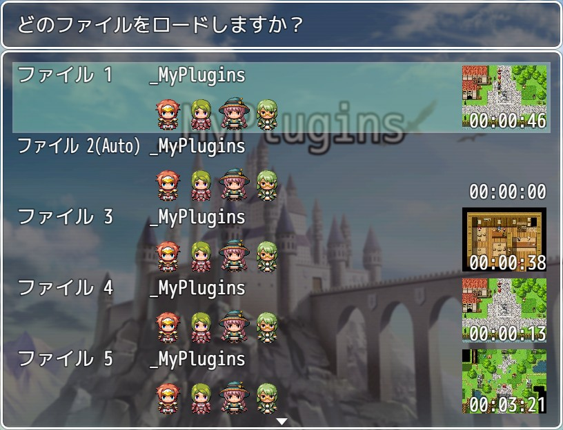

# YKNR_SaveThumbnail.js [Ver.1.1.2]
セーブデータにマップの現在地の画像をサムネイル用に保存し、  
セーブ画面/ロード画面にそのサムネイルを表示する機能を追加します。  

表示する場所は、セーブデータのリストの項目毎か、  
任意のウィンドウに現在選択中のセーブデータのサムネイルを表示させることができます。  

セーブデータに保存する画像の画質とサイズを指定することもできるため、  
ある程度データサイズを抑制することもできます。  

サムネイル撮影のタイミングは、メニュー画面を開くときに自動に撮影されます。  

また、準公式プラグイン **community-1.3** の「オートセーブ機能」でセーブされたデータには、  
サムネイルは表示しない仕様となっています。  

---

<!-- ここからURL一覧 -->
[LICENSE]: ./LICENSE
[【Download】]: https://raw.githubusercontent.com/Yakinori0424/RPGMakerMVPlugins/master/plugins/YKNR_SaveThumbnail/YKNR_SaveThumbnail.js
<!-- ここまでURL一覧 -->

## ダウンロード
*右クリック → 名前を付けて保存* でプラグインをダウンロードできます。  
[【Download】][]

---
## 使用方法
プラグインパラメータについて  
* 「サムネイルの自動生成」  
  false にした場合、サムネイルの撮影は手動で行うことになります。  
  その場合は、イベントコマンドの「スクリプト」から以下を呼び出してください。  
  `SceneManager.snapForThumbnail();`

* 「画質の設定」「サイズの設定：幅」「サイズの設定：高さ」  
  保存するデータサイズに関わる設定です。  
  サイズを大きく画質を良くすれば、サムネイルの品質は良くなりますが、  
  データが肥大化するので注意が必要です。

* 「ファイルリスト内に表示」  
  スクリーンショットのように、デフォルトのリストのウィンドウ内にサムネイルを表示します。  
  ここに表示する必要性が無ければ false にしてください。

* 「別ウィンドウの表示設定」  
  ファイルリスト内ではなく、他プラグインによって追加された任意のウィンドウに表示することも可能です。  
  表示したいウィンドウのクラス名を設定することで表示できます。  
  例えば **Window_Help** と設定すると、ヘルプウィンドウ内に選択中のセーブデータのサムネイルが表示されます。  
  (`SceneManager._scene._listWindow` を参照しているため、これが存在しない場合は正常に動作しません。)

---
## スクリーンショット
  

---
## License
ライセンスは MIT License です。  
[LICENSE][]

---
## Author
焼きノリ
[[Github](https://github.com/Yakinori0424/RPGMakerMVPlugins)]
[[Twitter](https://twitter.com/Noritake0424)]
[[欲しいもの](https://www.amazon.jp/hz/wishlist/ls/3HAY7QN91DUF2?ref_=wl_share)]
