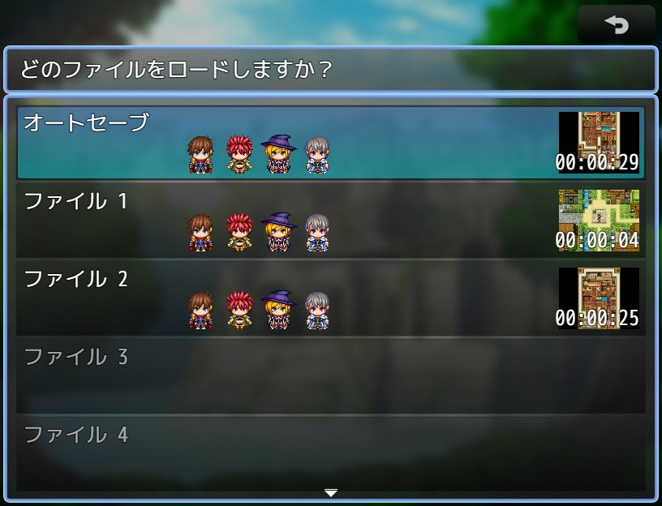

# YKNR_SaveThumbnail.js [Ver.1.2.0]
# YKNR_MZ_SaveThumbnail.js [Ver.1.0.0]
セーブデータにマップの現在地の画像をサムネイル用に保存し、  
セーブ画面/ロード画面にそのサムネイルを表示する機能を追加します。  

表示する場所は、セーブデータのリストの項目毎か、  
任意のウィンドウに現在選択中のセーブデータのサムネイルを表示させることができます。  

セーブデータに保存する画像の画質とサイズを指定することもできるため、  
ある程度データサイズを抑制することもできます。  

また、準公式プラグイン **community-1.3** の「オートセーブ機能」でセーブされたデータには、  
サムネイルは表示しない仕様となっています。(MV Only)  

MZ版は、MV版の移植に加えてオートセーブにもサムネイルが表示できるようになったほか、  
内部の処理も修正を加えています。  

---

<!-- ここからURL一覧 -->
[LICENSE]: ./LICENSE
[【Download for MV】]: https://raw.githubusercontent.com/Yakinori0424/RPGMakerMVPlugins/master/plugins/YKNR_SaveThumbnail/YKNR_SaveThumbnail.js
[【Download for MZ】]: https://raw.githubusercontent.com/Yakinori0424/RPGMakerMVPlugins/master/plugins/YKNR_SaveThumbnail/YKNR_MZ_SaveThumbnail.js
[共通プラグイン]: ../YKNR_Core
<!-- ここまでURL一覧 -->

## ダウンロード
*右クリック → 名前を付けて保存* でプラグインをダウンロードできます。  
[【Download for MV】][] 
[【Download for MZ】][]  
  
**MZ版の実行には、 [共通プラグイン][] が必要です！**  
**未導入の方はリンク先からダウンロードしてください。**

---
## 使用方法
プラグインパラメータについて  
* 「サムネイルの自動生成」**(MV Only)**  
  false にした場合、サムネイルの撮影は手動で行うことになります。  
  その場合は、イベントコマンドの「スクリプト」から以下を呼び出してください。  
  `SceneManager.snapForThumbnail();`

* 「読み込み速度高速化」**(MV Only)**  
  セーブ画面/ロード画面のglobalデータの読み込みを1回にすることで  
  同シーンの読み込み速度の改善を図ります。  
  これにより、スクロール時のもたつきも解消されます。

* 「画質の設定」「サイズの設定：幅」「サイズの設定：高さ」  
  保存するデータサイズに関わる設定です。  
  サイズを大きく画質を良くすれば、サムネイルの品質は良くなりますが、  
  データが肥大化するので注意が必要です。

* 「ファイルリスト内に表示」  
  スクリーンショットのように、デフォルトのリストのウィンドウ内にサムネイルを表示します。  
  ここに表示する必要性が無ければ false にしてください。

* 「別ウィンドウの表示設定」  
  ファイルリスト内ではなく、他プラグインによって追加された任意のウィンドウに表示することも可能です。  
  表示したいウィンドウのクラス名を設定することで表示できます。  

---
## スクリーンショット
  
  

---
## License
ライセンスは MIT License です。  
[LICENSE][]

---
## Author
焼きノリ
[[Github](https://github.com/Yakinori0424/RPGMakerMVPlugins)]
[[Twitter](https://twitter.com/Noritake0424)]
[[欲しいもの](https://www.amazon.jp/hz/wishlist/ls/3HAY7QN91DUF2?ref_=wl_share)]
