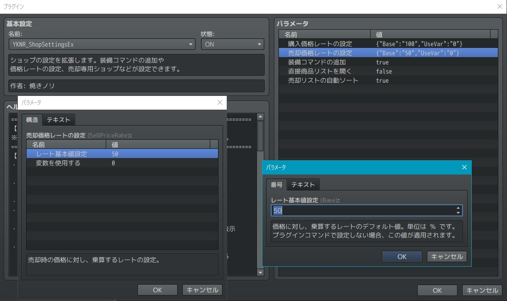
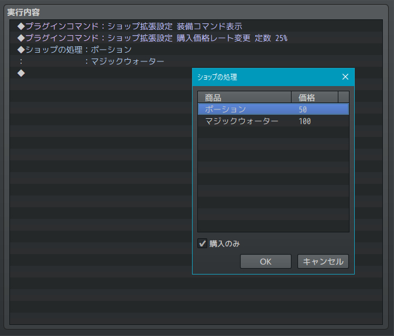
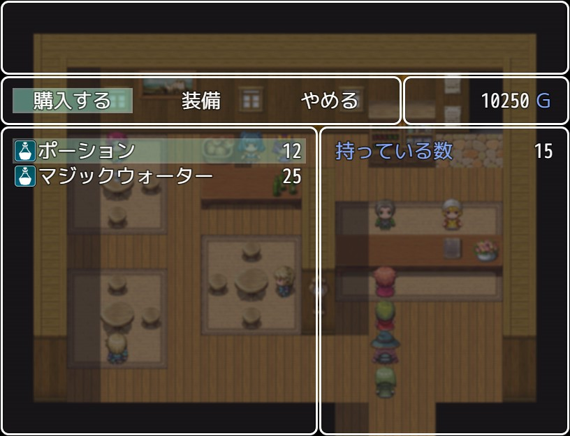
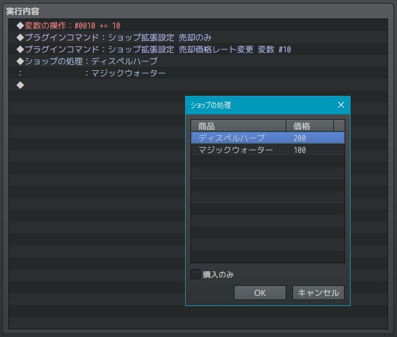
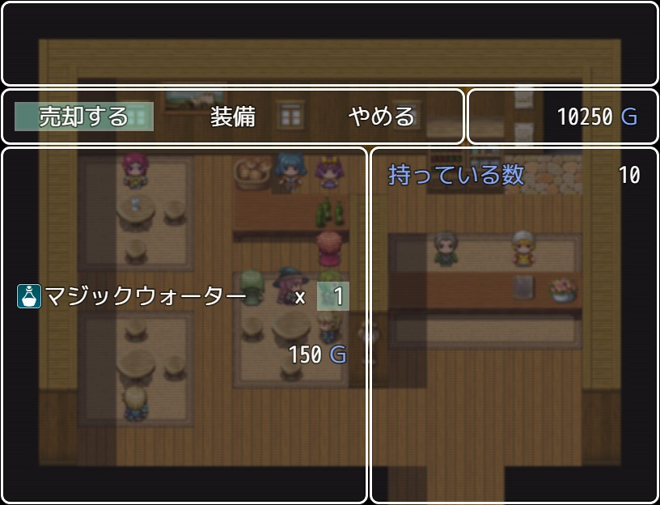

# YKNR_ShopSettingsEx.js [Ver.2.0.0]
ショップの設定を拡張します。  
装備コマンドの追加や価格レートの設定、売却専用ショップなどが設定できます。  
また、おまけで "売却時に売却可能なものがリストの先頭になるよう並び替える" 機能も備わっています。

---

<!-- ここからURL一覧 -->
[LICENSE]: ./LICENSE
[【Download】]: https://raw.githubusercontent.com/Yakinori0424/RPGMakerMVPlugins/master/plugins/YKNR_ShopSettingsEx/YKNR_ShopSettingsEx.js
<!-- ここまでURL一覧 -->

## ダウンロード
*右クリック → 名前を付けて保存* でプラグインをダウンロードできます。  
[【Download】][]

---
## 使用方法
プラグインパラメータで設定された値が初期値として設定されます。  
価格のレートと装備コマンドの表示状態は、プラグインコマンドで個別に設定が可能です。
  

プラグインコマンドは以下を用意しています。
|コマンド|説明|
|:--|:--|
|ショップ拡張設定 売却のみ|購入不可の売却のみのショップにすることができます。 その際、購入のみのチェックは外さないと、購入のみが優先されるので注意。 さらに商品を設定していると、その商品だけを売ることができる店になります。|
|ショップ拡張設定 装備コマンド表示 ショップ拡張設定 装備コマンド非表示|装備コマンドの表示設定をショップ個別に行えます。 武器屋のみ店での装備変更が可能、といった表現をしたいときに。|
|ショップ拡張設定 購入価格レート変更 定数 n% ショップ拡張設定 購入価格レート変更 変数 #n|購入時の価格のレートを変更できます。 定数の場合 : 'n' には任意の整数を入れてください。基本値は 100% です。 変数の場合 : 'n' には任意の変数の番号を入れてください。 (任意の変数の値 / 100.0) の値がレートとして設定されます。|
|ショップ拡張設定 売却価格レート変更 定数 n% ショップ拡張設定 売却価格レート変更 変数 #n|売却時の価格のレートを変更できます。 設定方法は "購入価格レート変更" と同じです。|

---
## スクリーンショット
購入価格を通常の設定の 25% に設定した場合  
 
  
 
売却価格を 変数10 に設定し、  
ディスペルハーブとマジックウォーターのみ売却可能な設定方法。  
イベント実行のたびに変数10を毎回10加算しているため、売却価格が10%ずつ上昇する。  
  
  

---
## License
ライセンスは MIT License です。  
[LICENSE][]

---
## Author
焼きノリ
[[Github](https://github.com/Yakinori0424/RPGMakerMVPlugins)]
[[Twitter](https://twitter.com/Noritake0424)]
[[欲しいもの](http://www.amazon.co.jp/registry/wishlist/3HAY7QN91DUF2/ref=cm_sw_r_tw_ws_x_i3sGyb08ST7P4)]
