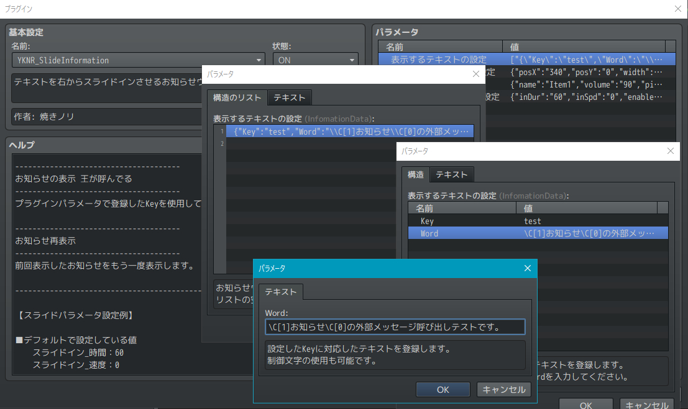
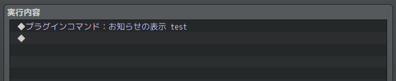

# YKNR_SlideInformation.js [Ver.2.0.0]
テキストを右からスライドインさせるお知らせウィンドウを追加します。
システム的なお知らせを表示するときなどに使えるかと思います。

---

<!-- ここからURL一覧 -->
[LICENSE]: ./LICENSE
[【Download】]: https://raw.githubusercontent.com/Yakinori0424/RPGMakerMVPlugins/master/plugins/YKNR_SlideInformation/YKNR_SlideInformation.js
<!-- ここまでURL一覧 -->

## ダウンロード
*右クリック → 名前を付けて保存* でプラグインをダウンロードできます。  
[【Download】][]

---
## 使用方法
プラグインパラメータの "表示するテキストの設定" からテキストを追加していきます。  
  

プラグインパラメータはほかにも、 "お知らせウィンドウの設定" でウィンドウを細かく調整できたり、  
お知らせが表示されたときに再生するSEの設定、テキストのスライドイン/アウトの設定も可能です。  
 

プラグインコマンドは以下を用意しています。
|コマンド|説明|
|:--|:--|
|お知らせの表示 test|プラグインパラメータで登録したKeyに対応したテキストを表示します。 この場合は "test" をKeyとするテキストが表示されます。|
|お知らせ再表示|前回表示したお知らせをもう一度表示します。|

---
## スクリーンショット
  
  

---
## License
ライセンスは MIT License です。  
[LICENSE][]

---
## Author
焼きノリ
[[Twitter](https://twitter.com/Noritake0424)]
[[Blog](http://mata-tuku.ldblog.jp/)]
