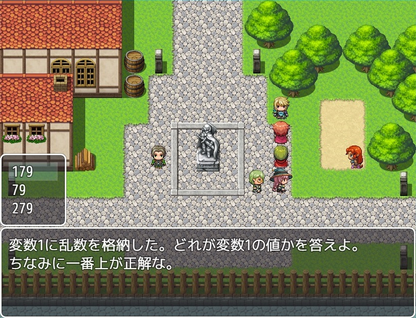

# YKNR_StringInterpolation.js [Ver.1.0.0]
String クラスに、式展開した文字列を返す関数を追加します。  
  
バッククオート(``)を用いても式展開可能ですが、  
ツクールMV内の文字列は('' or "")がメインなため、  
文字列からそれっぽく展開できるようにしました。  

---

<!-- ここからURL一覧 -->
[LICENSE]: ./LICENSE
[【Download】]: https://raw.githubusercontent.com/Yakinori0424/RPGMakerMVPlugins/master/plugins/YKNR_StringInterpolation/YKNR_StringInterpolation.js
<!-- ここまでURL一覧 -->

## ダウンロード
*右クリック → 名前を付けて保存* でプラグインをダウンロードできます。  
[【Download】][]

---
## 使用方法
説明文など

---
## スクリーンショット
  
  
  
  

---
## License
ライセンスは MIT License です。  
[LICENSE][]

---
## Author
焼きノリ
[[Twitter](https://twitter.com/Noritake0424)]
[[Blog](http://mata-tuku.ldblog.jp/)]
