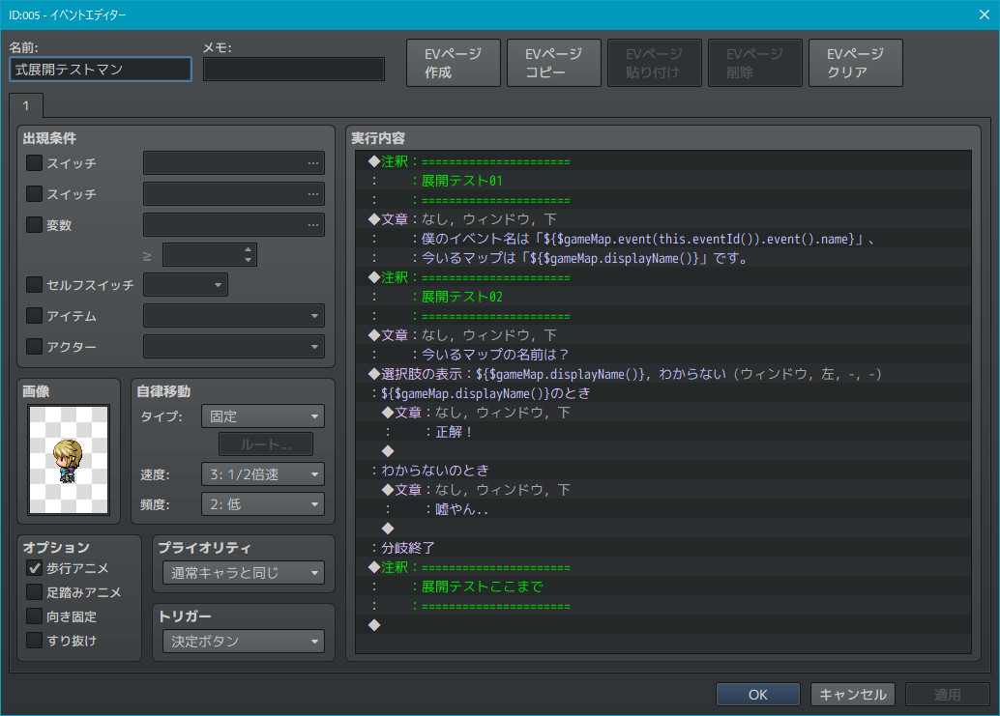

# YKNR_StringInterpolation.js [Ver.1.0.0]
Stringクラスに **式展開関数** を追加し、式内挿法を使用可能にします。  
  
JavascriptではES6から使えるようになった、バッククオート(``)で囲むことで式内挿法が使用可能になりますが、  
ツクールMV内の文字列は('' or "")がメインなため、文字列からそれっぽく展開できるようにしました。  

---

<!-- ここからURL一覧 -->
[LICENSE]: ./LICENSE
[【Download】]: https://raw.githubusercontent.com/Yakinori0424/RPGMakerMVPlugins/master/plugins/YKNR_StringInterpolation/YKNR_StringInterpolation.js
<!-- ここまでURL一覧 -->

## ダウンロード
*右クリック → 名前を付けて保存* でプラグインをダウンロードできます。  
[【Download】][]

---
## 使用方法
文字列中の `${(Javascript Code)}` が式展開を行うコードとして認識できます。  
`(Javascript Code)` には、任意のJavascriptを記述します。  
このJavascriptの返り値が実際の文字列となります。  

以下のイベントコマンドのテキストは、本プラグインの機能により式展開されます。
* 「メッセージの表示」のテキスト
* 「選択肢の表示」の各選択肢のテキスト
* 「プラグインコマンド」のテキスト

 

以下のテキストは、本プラグインの機能により式展開されます。
* 各データベースのヘルプのテキスト
* バトルログのテキスト
* その他、convertEscapeCharacters を通したテキスト全て

 

### 式展開関数
通常は、上記の式展開用のフォーマットを記述しても普通の文字列として評価されますが、  
内挿された式を展開しその結果を返す関数 String.prototype.interpolation で  
式展開後の文字列を返します。  

~~~javascript
    var message = '';
    message += '現在のマップのIDは ${$gameMap.mapId()}\n';
    message += '現在のマップの表示名は ${$gameMap.displayName()} です。';

    console.log(message.interpolation());
    // => 現在のマップのIDは 1
    //    現在のマップの表示名は テストマップ です。
~~~

### テンプレート関数
`(Javascript Code)` 部分をkeyとして扱い、  
別オブジェクトのkeyから値を取得する関数 String.prototype.template もおまけで実装しています。  
こちらも同様に、式展開後の文字列を返します。  

~~~javascript
    var message = '';
    message += '現在のマップのIDは ${mapId}\n';
    message += '現在のマップの表示名は ${abcdefg} です。';

    var values = {};
    values['mapId'] = $gameMap.mapId();
    values['abcdefg'] = $gameMap.displayName();
    
    console.log(message.template(values));
    // => 現在のマップのIDは 1
    //    現在のマップの表示名は テストマップ です。
~~~

---
## スクリーンショット
  
  
  
  

---
## License
ライセンスは MIT License です。  
[LICENSE][]

---
## Author
焼きノリ
[[Twitter](https://twitter.com/Noritake0424)]
[[Blog](http://mata-tuku.ldblog.jp/)]
