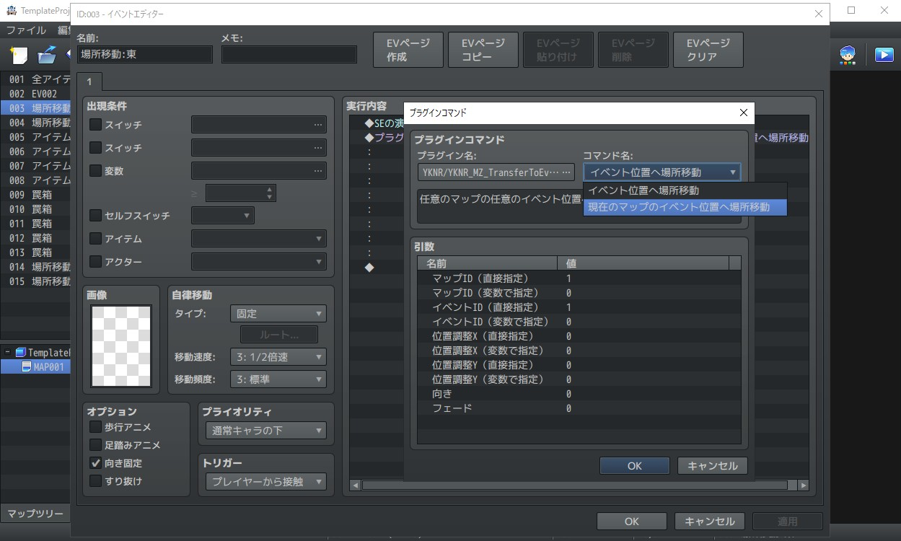

# YKNR_TransferToEvent.js [Ver.1.1.0]
マップ上の任意のイベントの位置へ場所移動ができるようになります。<br><br>
通常のイベントコマンドの「場所移動」では、<br>
ゲームの製作途中でマップの形状を調整すると、そのマップへ移動する全イベントをチェック/移動座標の修正が必要になりますが、<br>
本プラグインの機能を利用することで、そのマップ上のイベント位置を調整するだけで済むようになります。

---

<!-- ここからURL一覧 -->
[LICENSE]: ./LICENSE
[【Download for MZ】]: https://raw.githubusercontent.com/Yakinori0424/RPGMakerMVPlugins/master/plugins/YKNR_TransferToEvent/YKNR_MZ_TransferToEvent.js
<!-- ここまでURL一覧 -->

## ダウンロード
*右クリック → 名前を付けて保存* でプラグインをダウンロードできます。  
[【Download for MZ】][]

---
## 使用方法
このプラグインを導入することで以下のプラグインコマンドが使用可能になります。

「イベント位置へ場所移動」
-
マップとイベントIDを指定して場所移動を行います。<br>
向きとフェードはイベントコマンド「場所移動」と同様に設定できるほか、
イベント位置から何マスずらした位置に移動するかのオフセット値の設定ができます。

「現在のマップのイベント位置へ場所移動」
-
イベントIDを指定して場所移動を行います。<br>
こちらは現在のマップにある任意のイベントに移動させるため、マップIDの指定は省略されています。<br>
それ以外の設定については、「イベント位置へ場所移動」と同じです。<br>

---
### Tips
<details>
<summary>イベントとの相対位置を反映</summary>

---
これは主に、他プラグインによってイベントのトリガーの範囲を広げている際に、重宝することでしょう。

プラグインコマンド実行前に以下のスクリプトを実行しておくと、
実行しているイベントとの距離を変数1と2に代入します。<br>

```JavaScript
const xId = 1, yId = 2;
const a = $gamePlayer, b = this.character(0);
$gameVariables._data[xId] = $gameMap.deltaX(a.x, b.x);
$gameVariables._data[yId] = $gameMap.deltaY(a.y, b.y);
```

そして、プラグインコマンドの引数 **オフセット値X（変数で指定）** に「変数1」を、<br>
**オフセット値Y（変数で指定）** に「変数2」を設定すると実現できます。

必要に応じて、スクリプトでの代入先の変数番号を変えたり、<br>
プラグインコマンドでのオフセット値の変数の指定を「なし」にして、Y座標のみ or X座標のみ相対位置を反映させると良いでしょう。

---
</details>

---
## スクリーンショット
<br><br>

---
## License
ライセンスは MIT License です。  
[LICENSE][]

---
## Author
焼きノリ
[[Github](https://github.com/Yakinori0424/RPGMakerMVPlugins)]
[[Twitter](https://twitter.com/Noritake0424)]
[[欲しいもの](https://www.amazon.jp/hz/wishlist/ls/3HAY7QN91DUF2?ref_=wl_share)]
